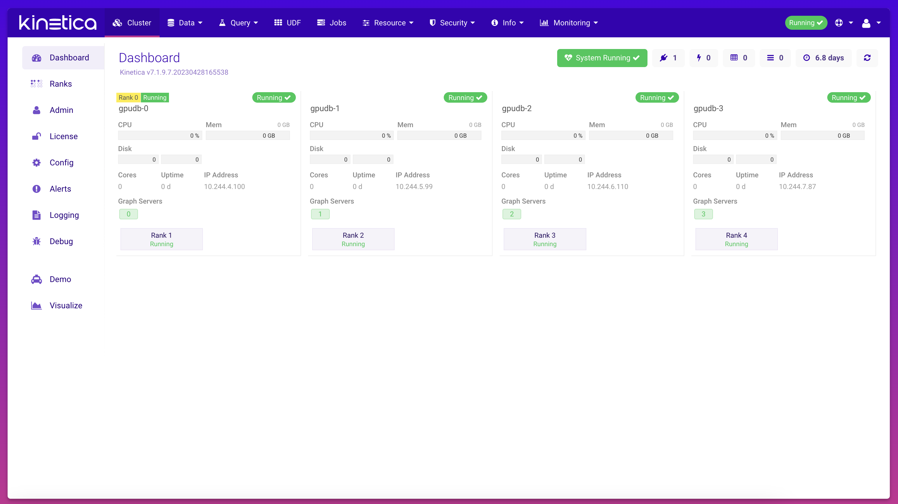

# Kinetica Database Configuration

* kubectl (yaml)

## KineticaCluster

To deploy a new Database Instance into a Kubernetes cluster...

=== "kubectl"
    Using kubetctl a CustomResource of type `KineticaCluster` is used to define a new Kinetica DB Cluster in a yaml file.

    The basic Group, Version, Kind or GVK to instantiate a Kinetica DB Cluster is as follows: -
    
    ```yaml title="kineticacluster.yaml" linenums="1"
    apiVersion: app.kinetica.com/v1
    kind: KineticaCluster
    ```

    ### Metadata

    to which we add a `metadata:` block for the name of the DB CR along with the `namespace` into which we are
    targetting the installation of the DB cluster.

    ```yaml title="kineticacluster.yaml" linenums="1"
    apiVersion: app.kinetica.com/v1
    kind: KineticaCluster
    metadata:
      name: my-kinetica-db-cr
      namespace: gpudb
    spec:
    ```

    ### Spec
    
    Under the `spec:` section of the KineticaCLuster CR we have a number of sections supporting different aspects
    of the deployed DB cluster:-

    * [gpudbCluster](#gpudbCluster)
    * [autoSuspend](#autoSuspend)
    * [gadmin](#gadmin)

    #### gpudbCluster

    Configuartion items specific to the DB itself.

    ```yaml title="kineticacluster.yaml - gpudbCluster" linenums="1"
    apiVersion: app.kinetica.com/v1
    kind: KineticaCluster
    metadata:
      name: my-kinetica-db-cr
      namespace: gpudb
    spec:
      gpudbCluster:
    ```

    ##### gpudbCluster

    ```yaml title="cluster name & size" linenums="1"
    clusterName: kinetica-cluster 
    clusterSize: 
      tshirtSize: M 
      tshirtType: LargeCPU 
    fqdn: kinetica-cluster.saas.kinetica.com
    haRingName: default
    hasPools: false    
    ```

    `1. clusterName` - the user defined name of the Kinetica DB Cluster

    `2. clusterSize` - block that defines the number of DB Ranks to run

    `3. tshirtSize` - sets the cluster size to a defined size based upon the t-shirt size. Valid sizes are: -

    * `XS` -   1 DB Rank
    * `S` -    2 DB Ranks
    * `M` -    4 DB Ranks
    * `L` -    8 DB Ranks
    * `XL` -   16 DB Ranks
    * `XXL` -  32 DB Ranks
    * `XXXL` - 64 DB Ranks

    `4. tshirtType` - block that defines the tyoe DB Ranks to run: -

    * `SmallCPU` - 
    * `LargeCPU` -
    * `SmallGPU` - 
    * `LargeGPU` -

    `5. fqdn` - The fully qualified URL for the DB cluster. Used on the Ingress records for any exposed services.

    `6. haRingName` - Default: `default`

    `7. hasPools` - Whether to enable the separate node 'pools' for "infra", "compute" pod scheduling.
                    Default: false
                    +optional

    #### autoSuspend

    The DB Cluster autosuspend section allows for the spinning down of the core DB Pods to release the underlying
    Kubernetes nodes to reduce infrastructure costs when the DB is not in use. 

    ``` yaml title="kineticacluster.yaml - autoSuspend" linenums="1" hl_lines="7 8 9"
    apiVersion: app.kinetica.com/v1
    kind: KineticaCluster
    metadata:
      name: my-kinetica-db-cr
      namespace: gpudb
    spec:
      autoSuspend:
        enabled: false
        inactivityDuration: 1h0m0s
    ```

    `7.` the start of the `autoSuspend` definition

    `8.` `enabled` when set to `true` auto suspend of the DB cluster is enabled otherwise set to `false` and no 
        automatic suspending of the DB takes place.  If omitted it defaults to `false`

    `9.` `inactivityDuration` the duration after which if no DB activity has taken place the DB will be suspended

    !!! info "Horizontal Pod Autoscaler"

        In order for `autoSuspend` to work correctly the Kubernetes Horizontal Pod Autoscaler needs to be deployed to
        the cluster.


    #### gadmin

    GAdmin the Database Administration Console

    


    ```yaml title="kineticacluster.yaml - gadmin" linenums="1" hl_lines="7 8 9 10 11 12"
    apiVersion: app.kinetica.com/v1
    kind: KineticaCluster
    metadata:
      name: my-kinetica-db-cr
      namespace: gpudb
    spec:
      gadmin:
        containerPort:
          containerPort: 8080
          name: gadmin
          protocol: TCP
        isEnabled: true
    ```

    `7.` `gadmin` configuration block definition

    `8.` `containerPort` configuration block i.e. where `gadmin` is exposed on the DB Pod

    `9.` `containerPort` the port number as an integer. Default: `8080`

    `10.` `name` the name of the port being exposed. Default:  `gadmin`

    `11.` `protocol` network protocal used. Default: `TCP`

    `12.` `isEnabled` whether `gadmin` is exposed from the DB pod. Default: `true`

### Example DB CR

```yaml
apiVersion: app.kinetica.com/v1
kind: KineticaCluster
metadata:
  name: kinetica-cluster
  namespace: gpudb
spec:
  autoSuspend:
    enabled: false
    inactivityDuration: 1h0m0s
  debug: false
  gadmin:
    isEnabled: true
  gpudbCluster:
    clusterName: kinetica-cluster
    clusterSize:
      tshirtSize: M
      tshirtType: LargeCPU
    config:
      graph:
        enable: true
      postgresProxy:
        enablePostgresProxy: true
      textSearch:
        enableTextSearch: true
      kifs:
        enable: false
      ml:
        enable: false
      tieredStorage:
        globalTier:
          colocateDisks: true
          concurrentWaitTimeout: 120
          encryptDataAtRest: true
        persistTier:
          default:
            highWatermark: 90
            limit: 4Ti
            lowWatermark: 50
            name: ''
            path: default
            provisioner: docker.io/hostpath
            volumeClaim:
              metadata: {}
              spec:
                resources: {}
                storageClassName: kinetica-db-persist
              status: {}
      tieredStrategy:
        default: VRAM 1, RAM 5, PERSIST 5
        predicateEvaluationInterval: 60
    fqdn: kinetica-cluster.saas.kinetica.com
    haRingName: default
    hasPools: false
    hostManagerPort:
      containerPort: 9300
      name: hostmanager
      protocol: TCP
    image: docker.io/kineticastagingcloud/kinetica-k8s-db:v7.1.9-8.rc1
    imagePullPolicy: IfNotPresent
    letsEncrypt:
      enabled: false
    license: >-

    metricsRegistryRepositoryTag:
      imagePullPolicy: IfNotPresent
      registry: docker.io
      repository: kineticastagingcloud/fluent-bit
      sha: ''
      tag: v7.1.9-8.rc1
    podManagementPolicy: Parallel
    ranksPerNode: 1
    replicas: 4
  hostManagerMonitor:
    monitorRegistryRepositoryTag:
      imagePullPolicy: IfNotPresent
      registry: docker.io
      repository: kineticastagingcloud/kinetica-k8s-monitor
      sha: ''
      tag: v7.1.9-8.rc1
    readinessProbe:
      failureThreshold: 20
      initialDelaySeconds: 5
      periodSeconds: 10
    startupProbe:
      failureThreshold: 20
      initialDelaySeconds: 5
      periodSeconds: 10
  infra: on-prem
  ingressController: nginx-ingress
  ldap:
    host: openldap
    isInLocalK8S: true
    isLDAPS: false
    namespace: gpudb
    port: 389
  payAsYouGo: false
  reveal:
    containerPort:
      containerPort: 8088
      name: reveal
      protocol: TCP
    isEnabled: true
  supportingImages:
    busybox:
      imagePullPolicy: IfNotPresent
      registry: docker.io
      repository: kineticastagingcloud/busybox
      sha: ''
      tag: v7.1.9-8.rc1
    socat:
      imagePullPolicy: IfNotPresent
      registry: docker.io
      repository: kineticastagingcloud/socat
      sha: ''
      tag: v7.1.9-8.rc1
```

## KineticaUser

## KineticaGrant

## KineticaSchema

## KineticaResourceGroup
