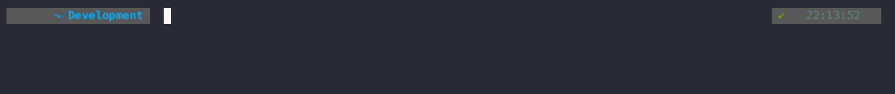
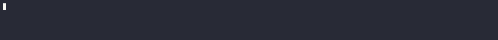

# Preparation & Prerequisites

Checks & steps to ensure a smooth installation.

!!! note "Obtain a Kinetica License Key"
    A product license key will be required for install.
    Please contact [Kinetica Support](mailto:support@kinetica.com "Kinetica Support Email") to request a trial key.
    
    Failing to provide a license key at installation time will prevent the DB from starting.

## Preparation and prerequisites

!!! warning "Free Resources"
    Your Kubernetes cluster version should be >= 1.22.x and have a minimum of 8 CPU, 8GB Ram and  
    SSD or SATA 7200RPM hard drive(s) with 4X memory capacity.

??? info "GPU Support"
    For GPU enabled clusters the cards below have been tested in large-scale production environments and 
    provide the best performance for the database.
    
    |       GPU       |         Driver          |
    |:---------------:|:-----------------------:|
    | **P4/P40/P100** | **525.X** _(or higher)_ |
    | **V100**        | **525.X** _(or higher)_ |
    | **T4** | **525.X** _(or higher)_ |   
    | **A10/A40/A100** | **525.X** _(or higher)_ | 

### Kubernetes Cluster Connectivity
Installation requires [**Helm3**](https://v3.helm.sh/docs/intro/install/ "Helm Installation Instructions") and access to an on-prem or CSP managed
Kubernetes cluster.
and the Kubernetes CLI [**kubectl**](https://kubernetes.io/docs/tasks/tools/#kubectl "Kubernetes CLI Installation Instructions").

The context for the desired target cluster must be selected from your `~/.kube/config` file and set via the
`KUBECONFIG` environment variable or `kubectl ctx` (if installed). Check to see if you have the correct context with,

``` sh title="show the current kubernetes context"
kubectl config current-context
```

and that you can access this cluster correctly with,

``` sh title="list kubernetes cluster nodes"
kubectl get nodes
```


If you do not see a list of nodes for your K8s cluster the helm installation will not work.
Please check your Kubernetes installation or access credentials (kubeconfig).

??? info "Air-Gapped Environments"
    If you are installing Kinetica with Helm in an air-gapped environment you will either need a Registry Proxy to pass
    the requests through or to download the images and push them to your internal Registry.

    ### Required Container Images
    #### docker.io (Required Kinetica Images for All Installations)
    * docker.io/kineticastagingcloud/kinetica-k8s-operator:v7.2.0-3.rc-3
        * docker.io/kineticastagingcloud/kinetica-k8s-cpu:v7.2.0-3.rc-3 **or** 
        * docker.io/kineticastagingcloud/kinetica-k8s-cpu-avx512:v7.2.0-3.rc-3 **or** 
        * docker.io/kineticastagingcloud/kinetica-k8s-gpu:v7.2.0-3.rc-3
    * docker.io/kineticastagingcloud/workbench-operator:v7.2.0-3.rc-3
    * docker.io/kineticastagingcloud/workbench:v7.2.0-3.rc-3
    * docker.io/kineticastagingcloud/kinetica-k8s-monitor:v7.2.0-3.rc-3
    * docker.io/kineticastagingcloud/busybox:v7.2.0-3.rc-3
    * docker.io/kineticastagingcloud/fluent-bit:v7.2.0-3.rc-3
    * docker.io/kinetica/kagent:7.1.9.15.20230823123615.ga

    #### nvcr.io (Required Kinetica Images for GPU Installations using `kinetica-k8s-gpu`)
    * nvcr.io/nvidia/gpu-operator:v23.9.1

    #### registry.k8s.io (Required Kinetica Images for GPU Installations using `kinetica-k8s-gpu`)
    * registry.k8s.io/nfd/node-feature-discovery:v0.14.2

    #### docker.io (Required Supporting Images)
    * docker.io/bitnami/openldap:2.6.7
    * docker.io/alpine/openssl:latest (used by bitnami/openldap)
    * docker.io/otel/opentelemetry-collector-contrib:0.95.0

    #### quay.io (Required Supporting Images)
    * quay.io/brancz/kube-rbac-proxy:v0.14.2

    ### Optional Container Images
    These images are only required if certain features are enabled as part of the Helm installation: -
    
    * CertManager
    * ingress-ninx
    
    #### quay.io (Optional Supporting Images)
    * quay.io/jetstack/cert-manager-cainjector:v1.13.3 (if optionally installing CertManager via Kinetica Helm Chart)
    * quay.io/jetstack/cert-manager-controller:v1.13.3 (if optionally installing CertManager via Kinetica Helm Chart)
    * quay.io/jetstack/cert-manager-webhook:v1.13.3 (if optionally installing CertManager via Kinetica Helm Chart)

    #### registry.k8s.io (Optional Supporting Images)
    * registry.k8s.io/ingress-nginx/controller:v1.9.4 (if optionally installing Ingress nGinx via Kinetica Helm Chart)
    * registry.k8s.io/ingress-nginx/controller:v1.9.6@sha256:1405cc613bd95b2c6edd8b2a152510ae91c7e62aea4698500d23b2145960ab9c
    
    ### Which Kinetica Core Image do I use?

    | Container Image | Intel (AMD64) | Intel (AMD64 AVX512) | Amd (AMD64) | Graviton (aarch64) | Apple Silicon (aarch64) |
    | :-------------- | :------------: | :-------------------: | :----------: | :-----------------: | :----------------------: |
    | kinetica-k8s-cpu | :octicons-check-circle-fill-24: | :octicons-check-circle-fill-24:(1) | :octicons-check-circle-fill-24: | :octicons-check-circle-fill-24: | :octicons-check-circle-fill-24: | 
    | kinetica-k8s-cpu-avx512 |  | :octicons-check-circle-fill-24: |  |  |  | 
    | kinetica-k8s-gpu | :octicons-check-circle-fill-24:(2) | :octicons-check-circle-fill-24:(2) | :octicons-check-circle-fill-24:(2) |  |  | 

    1. It is preferable on an Intel AVX512 enabled CPU to use the kinetica-k8s-cpu-avx512 container image
    2. With a supported nVidia GPU.

[//]: # (:octicons-x-circle-fill-24:)

## Install the kinetica-operators chart

This chart will install the Kinetica K8s operators together with a default configured database and workbench UI.

### 1. Add the Kinetica chart repository

Add the repo locally as *kinetica-operators*:

``` sh title="Helm repo add"
helm repo add kinetica-operators https://kineticadb.github.io/charts
```



### 2. Obtain the default Helm values file

For the generic Kubernetes install use the following values file without modification.
Advanced users with specific requirements may need to adjust parameters in this file.

``` sh title="Helm values.yaml download"
wget https://raw.githubusercontent.com/kineticadb/charts/master/kinetica-operators/values.onPrem.k8s.yaml
```

### 3. Determine the following prior to the chart install

!!! info inline end "Default Admin User"
    the default admin user in the Helm chart is `kadmin` but this is configurable.
    Non-ASCII characters and typographical symbols in the password must be escaped with a "\". For
    example, `--set dbAdminUser.password="MyPassword\!"`

1. Obtain a LICENSE-KEY as described in the introduction above.
2. Choose a PASSWORD for the initial administrator user
3. As the storage class name varies between K8s flavor and/or there can be multiple,
   this must be prescribed in the chart installation.
   Obtain the DEFAULT-STORAGE-CLASS name with the command:

<br/>

``` sh title="Find the default storageclass"
kubectl get sc -o name 
```



use the name found after the /, For example, in `storageclass.storage.k8s.io/local-path` use "local-path" as the
parameter.

!!! warning "Amazon EKS"
    If installing on Amazon EKS [_See here_](eks.md#ebs-csi-driver)